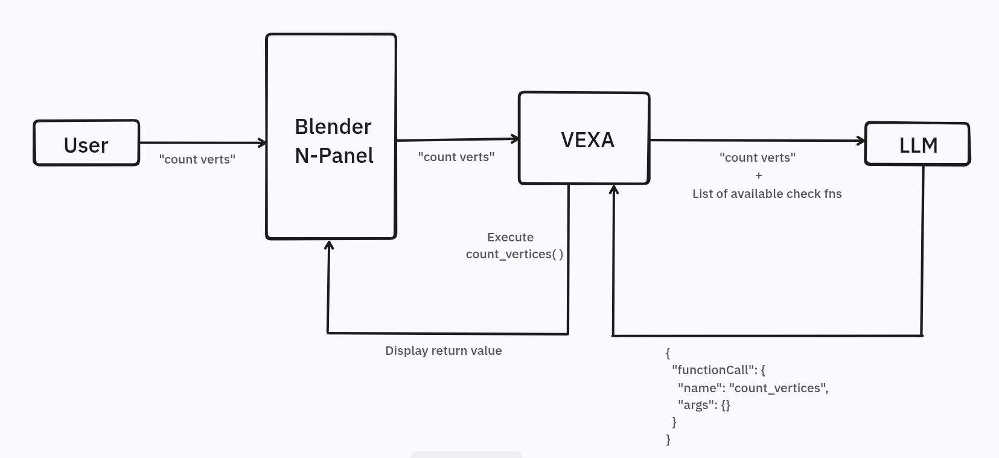

# Vexa

Technical documentation for developers.

## Architecture

Vexa has two execution paths:

### Inference Path
1. Select object(s) and type a prompt in Blender's N-Panel
2. Prompt + available functions sent to LLM as JSON schema
3. LLM returns structured function call
4. Vexa executes the function in Blender
5. Result displayed in panel

 

### Direct Path
1. User clicks action button
2. Vexa executes the function in Blender
3. Result displayed in panel

Both paths use the same underlying tools from the registry.

## Implemented Checks

- **Detect N-gons** 
- **Triangulate N-gons** 
- **count_vertices**
- **rename_object(new_name)** 
- **select_hard_edges** 
- **select_faces_with_intersecting_meshes** 
- **detect_nonplanar_faces**

## Adding New Tools

```python
from vexa.core.registry import AgentTools

@AgentTools.register(
    display_name="My Check",
    is_quick_action=True,
    category="Geometry",
)
def my_tool() -> str:
    """Description shown to LLM."""
    return "Result message"
```